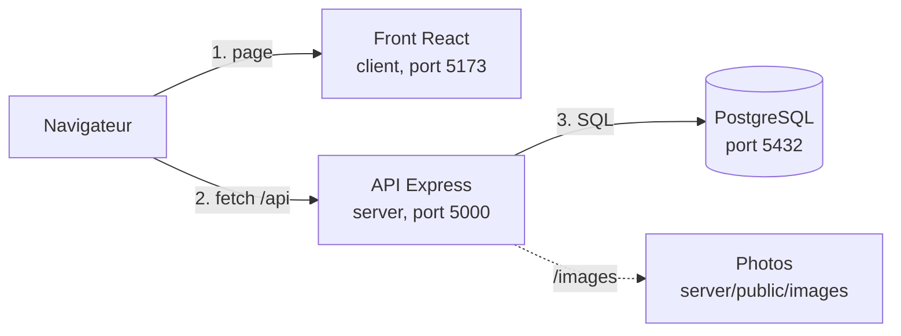

# NDAKO TECH

**Trouver un logement à Brazzaville et Pointe-Noire, sans commission et sans intermédiaire.**
Le chercheur filtre les annonces, consulte une fiche transparente (loyer ferme, statut daté, badge « Bien vérifié ») et contacte directement le gestionnaire par WhatsApp ou par téléphone.

!

| | |
|---|---|
| **Projet** | Plateforme de recherche de logements, version MVP1 |
| **Villes couvertes** | Brazzaville, Pointe-Noire (République du Congo) |
| **Front-end** | React, Vite, React Router |
| **Back-end** | Node.js, Express 5, PostgreSQL |
| **Équipe** | Squad 1, formation Fullstack à Akieni Academy : 7 développeurs |

**Sommaire** : [Présentation](#présentation) · [Fonctionnalités](#fonctionnalités-du-mvp1) · [Architecture](#architecture) · [Démarrage](#démarrage-rapide) · [Documentation](#documentation) · [API](#api-en-bref) · [Équipe](#léquipe) · [Workflow Git](#workflow-git) · [Qualité](#qualité-et-tests) · [Déploiement](#déploiement) · [Sécurité](#sécurité) · [Feuille de route](#feuille-de-route) · [Dépannage](#dépannage)

---

## Présentation

Chercher un logement au Congo reste difficile : annonces dispersées, prix qui changent selon l'interlocuteur, biens déjà occupés, intermédiaires non certifiés, risques d'arnaque. NDAKO TECH répond avec quelques principes simples :

| Principe | Ce que ça signifie |
|---|---|
| **Loyer ferme** | Le loyer affiché est le loyer réel : aucun frais caché, aucune commission |
| **Statut daté** | Chaque bien est Disponible ou Occupé, avec la date de dernière mise à jour |
| **Contact direct** | WhatsApp ou appel vers le gestionnaire, avec un message prérempli mentionnant le bien |
| **Biens vérifiés** | Un badge signale les annonces contrôlées par l'équipe |
| **Informations honnêtes** | Une annonce sans photo est signalée « incomplète », une caution inconnue est indiquée comme « à confirmer » |

## Fonctionnalités du MVP1

Périmètre défini par la spécification du produit (SPEC Immo-Congo, version 2).

| Code | Fonctionnalité | Statut |
|---|---|---|
| EF-01 | Recherche par filtres : ville, quartier, loyer maximum, eau courante, compteur électrique | Livré |
| EF-02 | Liste des résultats : photo, loyer en FCFA, quartier, statut | Livré |
| EF-03 | Fiche logement : galerie, loyer, équipements, statut daté, contact | Livré |
| EF-04 | Statut Disponible ou Occupé avec date ; les biens occupés sont exclus de la recherche | Livré |
| EF-05 | Contact direct par WhatsApp et appel, désactivé sur un bien occupé | Livré |
| EF-06 | Badge « Bien vérifié » (marquage dans les données, sans contrôle automatique) | Livré |
| EF-12 | Formulaire de publication d'annonce | Vitrine : n'enregistre rien |
| EF-13 | Connexion annonceur | Vitrine : aucune création de compte |

---

## Architecture

Le projet contient **deux applications indépendantes** dans un même dépôt : le front React et l'API Express. Elles communiquent en HTTP, au format JSON.



```
G_AFRINOVA_Project_NdakoTech_S17/
├── client/                        # Application React (voir client/README.md)
│   ├── docs/accueil.png
│   └── src/                       # api, components, pages, utils, index.css, pages.css
├── server/                        # API Express (voir server/README.md)
│   ├── public/images/             # Photos des logements
│   ├── src/                       # routes, controllers, models, middlewares, config
│   ├── schema.sql                 # Schéma PostgreSQL
│   ├── seed.sql                   # Données de démonstration
│   ├── Diagram ER.png             # Diagramme entité-relation
│   └── NdakoTech_postman_collection.json
├── docs/                          # Documents du projet (guide de déploiement)
├── .gitignore
└── README.md                      # Ce fichier
```

| Brique | Dossier | Port | Technologies |
|---|---|---|---|
| Front-end | `client/` | 5173 | React, Vite, React Router, CSS à variables |
| API | `server/` | 5000 | Node.js, Express 5 (ES modules), `pg`, CORS, dotenv |
| Base de données | `server/schema.sql` | 5432 | PostgreSQL : 4 tables (`utilisateur`, `logement`, `photo`, `signalement`) |

---

## Démarrage rapide

Prérequis : **Node.js 20.19+ ou 22.12+**, **PostgreSQL** et **Git**.

```bash
git clone <url-du-depot>
cd G_AFRINOVA_Project_NdakoTech_S17
```

**1. Base de données**

```bash
psql -U postgres -h localhost -c 'CREATE DATABASE "Immobilier_db";'
psql -U postgres -h localhost -d Immobilier_db -f server/schema.sql
psql -U postgres -h localhost -d Immobilier_db -f server/seed.sql
```

Les guillemets autour de `Immobilier_db` conservent la majuscule du nom. `schema.sql` ne se lance qu'une fois sur une base vide ; `seed.sql` vide les tables avant de les remplir.

**2. API** (premier terminal)

```bash
cd server
cp .env.example .env         # puis renseigner DB_USER, DB_PASSWORD, DB_NAME...
npm install
npm run dev                  # http://localhost:5000
```

La console doit afficher `Serveur lancé sur http://localhost:5000`, puis `Connexion à la base de données réussie`.

**3. Front** (second terminal)

```bash
cd client
cp .env.example .env         # VITE_API_URL=http://localhost:5000/api
npm install
npm run dev                  # http://localhost:5173
```

**4. Vérifier**

| Adresse | Résultat attendu |
|---|---|
| `http://localhost:5000/api/hello` | Un message JSON |
| `http://localhost:5000/api/logements?ville=Brazzaville` | 6 logements |
| `http://localhost:5000/images/studio-bacongo-1.jpg` | Une photo (si le fichier est présent) |
| `http://localhost:5173` | La page d'accueil du site |

Les `.env` ne sont **jamais** commités : seuls les `.env.example` le sont.

---

## Documentation

| Document | Contenu |
|---|---|
| [`server/README.md`](./server/README.md) | API : routes, paramètres, réponses, erreurs, base de données, règles de gestion, tests, limites connues |
| [`client/README.md`](./client/README.md) | Front : architecture, pages, composants, charte graphique, conventions |
| [`server/Diagram ER.png`](./server/Diagram%20ER.png) | Diagramme entité-relation |
| `server/NdakoTech_postman_collection.json` | Collection Postman : 26 requêtes qui testent toute l'API |
| [`docs/Guide_Deploiement_Render_NdakoTech.pdf`](./docs/Guide_Deploiement_Render_NdakoTech.pdf) | Guide de déploiement pas à pas sur Render |

## API en bref

URL de base : `http://localhost:5000/api`. Toutes les routes sont en lecture seule (`GET`).

| Endpoint | Rôle |
|---|---|
| `/hello` | Test de communication |
| `/quartiers?ville=` | Quartiers d'une ville |
| `/logements?ville=` | Recherche filtrée : `quartier`, `loyer_max`, `type_bien`, `eau_courante`, `compteur_electrique`, `tri` |
| `/logements/tous` | Liste complète, tous statuts |
| `/logements/:id` | Fiche détaillée, avec contact si le bien est disponible |

`ville` est obligatoire pour la recherche. Les erreurs de validation renvoient un `400` avec un objet `champs` indexé par paramètre. La référence complète est dans [`server/README.md`](./server/README.md).

---

## L'équipe

NDAKO TECH est construit par **sept développeurs**, répartis en deux équipes. Chacun est responsable d'une partie bien définie, ce qui permet de travailler en parallèle sans se marcher dessus.

### Back-end (API et base de données)

| Développeur | Responsabilité | Branches |
|---|---|---|
| **Christian** | Administrateur du dépôt. Socle du serveur, base de données (schéma, seed, images), README et déploiement | `chore/back-socle`, `feature/back-base-donnees`, `docs/back-readme`, `feature/back-deploiement` |
| **Marlong** | Recherche et liste des logements, tests Postman | `feature/back-recherche`, `test/back-postman` |
| **Lorion** | Fiche logement et quartiers par ville | `feature/back-fiche-logement`, `feature/back-quartiers` |

### Front-end (interface React)

| Développeur | Responsabilité | Dossier | Branche |
|---|---|---|---|
| **Réel** | Composants réutilisables | `components` | `feature/front-components` |
| **Gédéon** | Couche d'appel à l'API | `api` | `feature/front-api` |
| **guyverma** | Pages de l'application | `pages` | `feature/front-pages` |
| **gaevie** | Style et charte graphique | `index.css`, `pages.css` | `feature/front-style` |

Les détails de chaque partie sont dans le README du dossier concerné. Toute modification **en dehors de sa partie** se discute d'abord avec son responsable.

---

## Workflow Git

La branche **`main` est protégée** : on n'y pousse jamais directement. Tout le code y entre par une **Pull Request**, relue et approuvée par **un autre développeur**, puis **fusionnée dans `main` juste après la review**.

```bash
git checkout main
git pull origin main
git checkout -b feature/front-pages      # ou feature/back-recherche, etc.

# ... coder, tester ...

git add <fichiers>
git status                               # aucun .env, aucun node_modules
git commit -m "feat: ajout de la page de résultats"
git push -u origin feature/front-pages
```

1. Ouvrir une **Pull Request vers `main`** sur GitHub, avec une courte description et la façon de la tester.
2. Demander la **review d'un autre développeur** : jamais l'auteur lui-même.
3. Corriger les remarques sur la même branche.
4. Après approbation, **fusionner dans `main`** immédiatement, puis supprimer la branche.
5. Récupérer `main` (`git pull origin main`) avant de commencer le travail suivant.

| Préfixe de branche | Usage | Exemples |
|---|---|---|
| `feature/` | Nouvelle fonctionnalité | `feature/back-recherche`, `feature/front-components` |
| `fix/` | Correction de bug, y compris urgente | `fix/back-filtre-loyer` |
| `chore/` | Configuration, dépendances | `chore/back-socle` |
| `docs/` | Documentation | `docs/back-readme` |
| `test/` | Tests | `test/back-postman` |

Nom en minuscules, avec des tirets, sans espace ni accent, préfixé par `back-` ou `front-` selon la partie. **Messages de commit** : `type: description courte`, avec `feat`, `fix`, `docs`, `chore`, `test` ou `refactor`.

**Règles d'équipe**

- Une Pull Request = un sujet, petite et relue vite.
- Ne jamais commiter `.env`, `node_modules` ni de secret. Lire `git status` avant chaque commit.
- Se mettre à jour depuis `main` chaque jour pour éviter les gros conflits.
- Fichiers partagés du back (`logementModel.js`, `logementController.js`, `logementRoute.js`) : chacun travaille dans **sa propre section**.
- En cas de conflit sur un fichier qui n'est pas le sien, parler d'abord à son responsable.

## Qualité et tests

| Contrôle | Comment | Qui |
|---|---|---|
| API | Collection Postman : 26 requêtes, à lancer après `seed.sql` | Back-end |
| Build du front | `cd client && npm run build` sans erreur | Front-end |
| Style du code | `npm run lint` dans `client/` | Front-end |
| Parcours manuel | Recherche, fiche, bien occupé (contact désactivé), bien sans photo | Tous |

**Avant d'ouvrir une Pull Request :**

- [ ] Le serveur démarre sans erreur et la collection Postman passe (si le back est concerné)
- [ ] `npm run build` réussit (si le front est concerné)
- [ ] Les écrans touchés s'affichent avec l'API lancée
- [ ] Aucun `.env` ni `node_modules` dans le commit
- [ ] Le README est mis à jour si le comportement ou une route a changé

---

## Déploiement

Le projet se déploie sur **Render**, en trois services :

| Service | Dossier | Réglages principaux |
|---|---|---|
| PostgreSQL | | Base créée en ligne, puis `schema.sql` et `seed.sql` chargés |
| Web Service (API) | `server` | Build `npm install`, démarrage `npm start`, variables `DB_*`, `CLIENT_URL`, `NODE_ENV` |
| Static Site (front) | `client` | Build `npm install && npm run build`, publication `dist`, variable `VITE_API_URL`, règle `/*` vers `/index.html` |

On déploie depuis **`main` uniquement**. Les variables d'environnement se configurent sur Render, jamais dans le dépôt. La procédure complète, avec les limites du plan gratuit et le dépannage, est dans le guide PDF du dossier `docs/`.

## Sécurité

- Aucun secret dans le dépôt : mots de passe et adresses de base vont dans les `.env` locaux, ou dans les variables de l'hébergeur.
- Les requêtes SQL sont **paramétrées** et le tri passe par une liste blanche : aucune valeur utilisateur n'est insérée dans le SQL.
- CORS est limité à l'adresse du front (`CLIENT_URL`).
- En production, `NODE_ENV=production` masque le détail technique des erreurs 500.
- Un secret qui a fuité est considéré comme compromis : on change le mot de passe, la suppression du fichier ne suffit pas.
- L'API est en lecture seule dans cette version : aucune donnée n'est modifiable depuis le site.

---

## Feuille de route

| Évolution | Point de départ dans le code |
|---|---|
| Publication réelle d'annonces avec envoi de photos | Formulaire de démonstration (EF-12) ; prévoir un stockage externe des photos |
| Comptes annonceurs et authentification | Écran de connexion de démonstration (EF-13) |
| Signalement d'annonces par les visiteurs | Table `signalement` déjà créée, aucune route pour l'instant |
| Vérification des annonces plus rigoureuse | Aujourd'hui, simple marquage `verifie` dans les données |
| Équipements dans les résultats de recherche | Ajouter `eau_courante` et `compteur_electrique` au `SELECT` de `rechercher` |
| Base de données distante sécurisée | Prévoir l'option `ssl` dans `config/database.js` |

Les autres limites connues de l'API sont listées dans [`server/README.md`](./server/README.md#limites-connues).

## Dépannage

| Symptôme | Où regarder |
|---|---|
| `ERR_CONNECTION_REFUSED` sur `localhost:5000` | L'API n'est pas lancée : `cd server && npm run dev` |
| Le site s'affiche, mais sans données | `VITE_API_URL` dans `client/.env`, puis relancer `npm run dev` |
| `blocked by CORS policy` | `CLIENT_URL` dans `server/.env` : exactement `http://localhost:5173`, sans `/` final |
| Photos cassées | `server/public/images/` : les noms doivent être identiques à ceux de `seed.sql` |
| `relation "logement" does not exist` | `schema.sql` puis `seed.sql` n'ont pas été exécutés |
| `Failed to resolve import ...` | Fichier du front absent ou mal nommé : vérifier le chemin et la casse |

Le dépannage détaillé se trouve dans [`server/README.md`](./server/README.md#dépannage) pour l'API et dans [`client/README.md`](./client/README.md#dépannage) pour le front.
